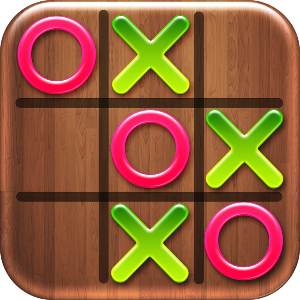
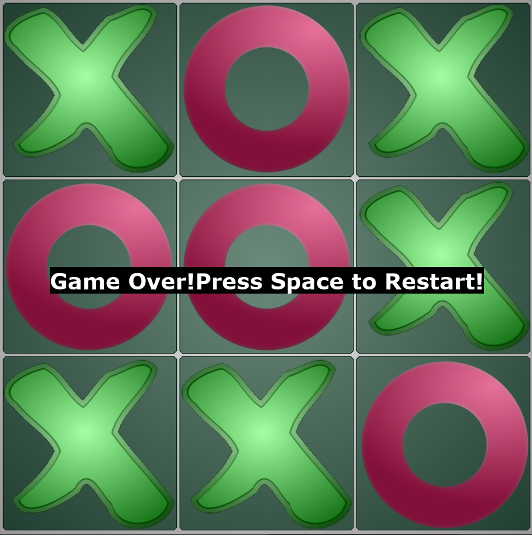
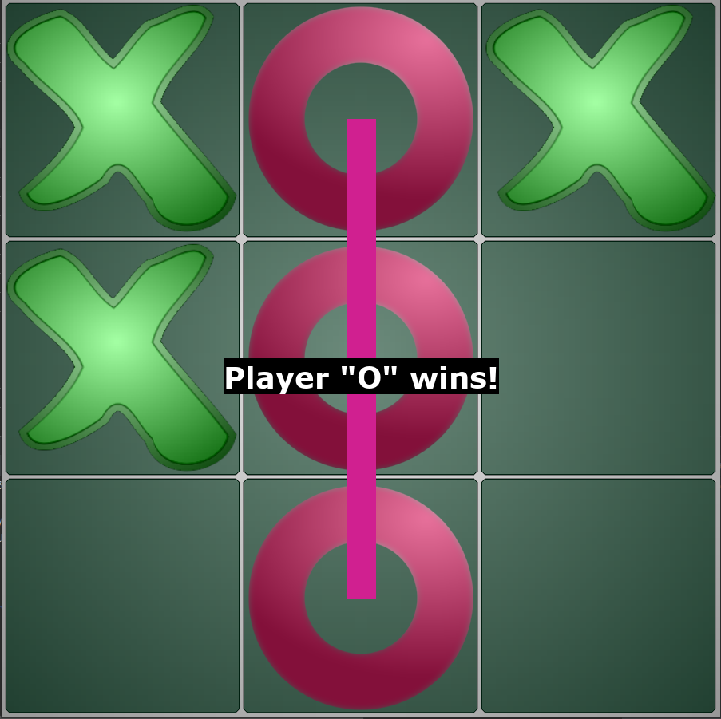
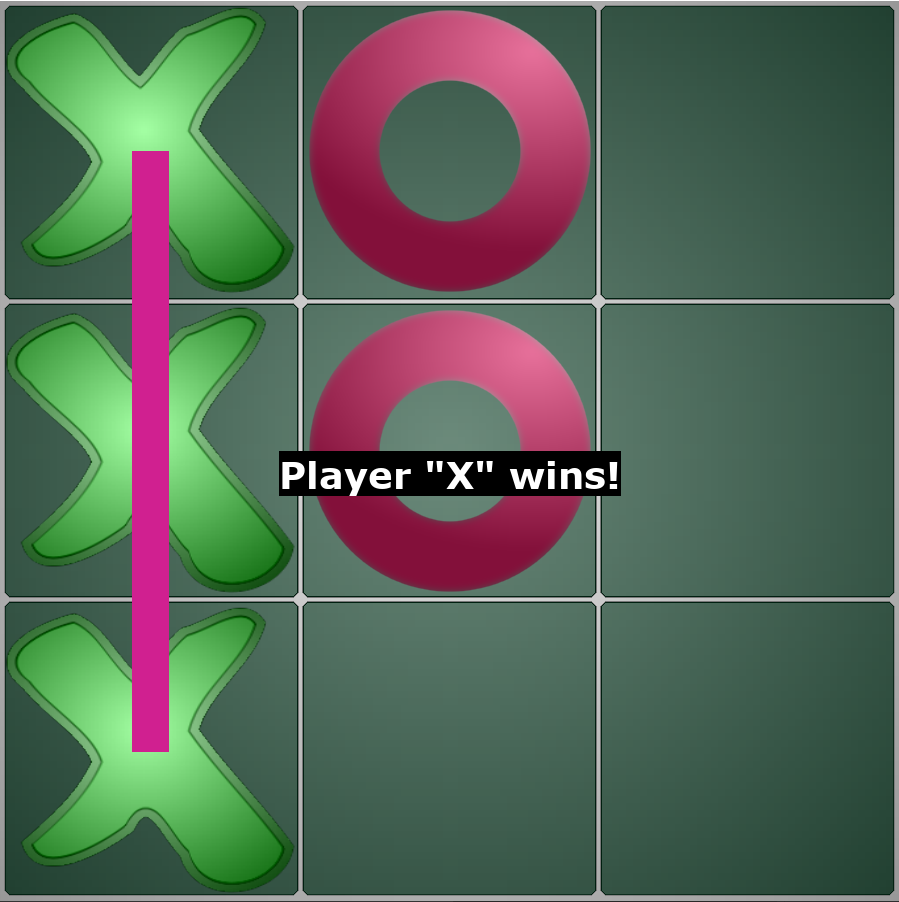

#                       TicTacToe
Python Pygame TicTacToe

# goals
This is a simple Pygame!
The game is a part of my educational project in **_SoftUni_** course and implemented as a challenge.

# Solution 
The game uses the `PyGame` library and `random` the `randint` function.
The computer's moves are randomized, and the player chooses them himself.

# Source code link
Before start the game, import libraries `pygame` and `random`.
Then start Game form this file:
`main.py`
# Game started:

Then make your choice by typing with mouse in game screen.
If game finished with __"No Winner" :__

Press `Space` button to Restart the game.

If winner is player __"O" :__

Press `Space` button to Restart the game.
If winner is player __"X" :__

Press `Space` button to Restart the game.